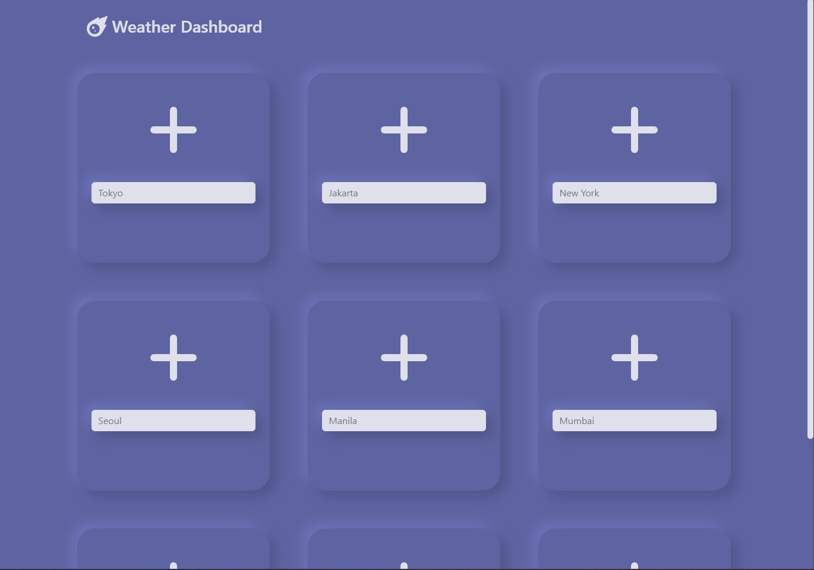
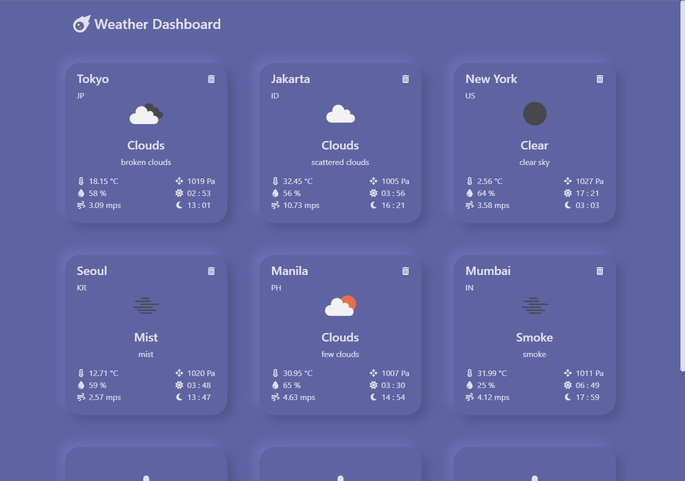
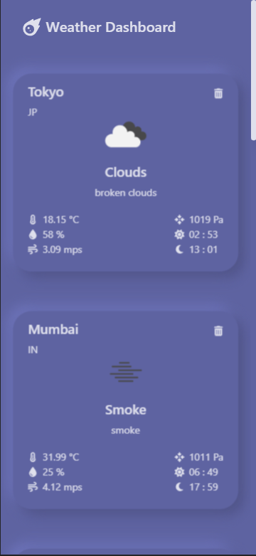

# Weather Dashboard

React app that has 9 cards to save your preferred cities to keep track of the weather of. Try it out [here](https://weather-dashb0ard.netlify.app/) .

## Features
* Offline first. Keeps the data in your browser. Loads previously fetched data on next startup.
* Responsive Design
* Automatically updates weather every 30 seconds

## Running the App
* Run ``npm i`` to install libraries
* Run ``npm run start`` to run locally

## How to add a city to your dashboard
* Type in the city name
* Press Enter or click on the plus icon

### Screenshots

### Tools uses
* React
* Bootstrap
* OpenWeather API
* FontAwesome Icons